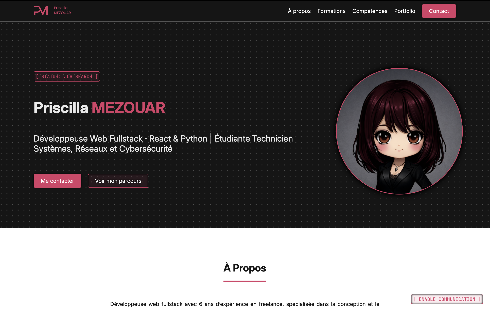

# 👩‍💻 Priscilla MEZOUAR

🔗 **Live Demo** : https://pmezouar.github.io/  
📱 Compatible mobile et desktop

---

## ✨ À propos du projet

**pmezouar** est un site vitrine conçue pour être mon CV virtuel. Il présente mes formations, certifications et compétences techniques.

Le projet vise également à présenter les différents projets que j'ai réalisé à travers mon portfolio. 

Ce projet a été imaginé dans une logique de **portfolio** moderne et dynamique.

---

## 🎯 Objectifs

* Me présenter 
* Présenter mes formations et certifications
* Présenter mes compétences techniques
* Présenter mes projets réalisés

---

## 🧠 Approche technique

Ce projet a été développé avec une attention particulière portée à :

* 🔎 La navigation et la recherche d’informations
* 📱 L’accessibilité et le responsive design
* 📈 L'évolution et la maintenabilité

---

## 🛠️ Stack technique

### Frontend

* HTML5
* CSS3
* JS léger (animation menu de navigation)

---

### Outils

* Git / GitHub
* VS Code

---

## 📸 Aperçu

---

## 💼 Auteur

Développé par **Priscilla MEZOUAR**

🌐 Portfolio : https://pmezouar.github.io
💼 LinkedIn : https://www.linkedin.com/in/pmezouar
📧 Email : [mezouar.priscilla@gmail.com](mailto:mezouar.priscilla@gmail.com)

---

⭐ Ce projet a été développé dans une démarche de présentation de mes compétences. N’hésitez pas à explorer le projet et à me faire des retours !